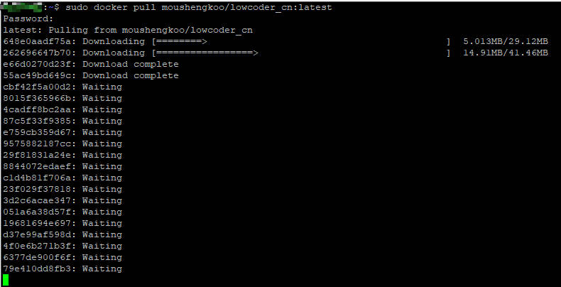
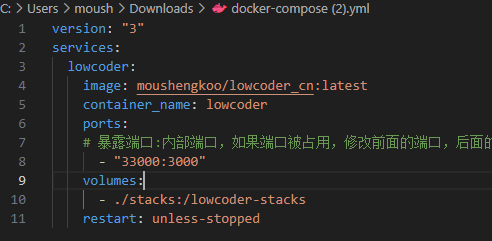

您可以选择使用 Docker-Compose  (推荐）或者 Docker 私有化部署Lowcoder。


### 软件环境

windows下使用Docker必须先安装[Docker Desktop](https://www.runoob.com/docker/windows-docker-install.html)，Linux可直接安装Docker和Docker-Compose

在命令行里查看docker和docker-compose的版本
```bash
docker -v
docker-compose -v
```


如果版本低于以下最低版本，请自行百度搜索更新方法

* [Docker](https://docs.docker.com/get-docker/)（最低版本：20.10.7）
* [Docker-Compose](https://docs.docker.com/compose/install/)（最低版本：1.29.2）


> 💡 说明
>
> * 服务器最低要求：2 核 CPU 和 4 GB RAM
> * Windows 推荐使用 PowerShell 来执行以下命令

### 拉取镜像
输入以下命令拉取最新镜像，镜像约 500 MB。

> 💡 权限
> * linux下命令前面加上 `sudo`+ 空格，防止权限不足

```
docker pull moushengkoo/lowcoder_cn:latest
```

​

!> 如使用latest标签但拉取的镜像却不是最新的，可到 [DockerHub](https://hub.docker.com/r/moushengkoo/lowcoder_cn/tags) 复制最新的tag再拉取，并修改docker-compose.yml文件或命令行中的latest为复制的tag

### 创建目录

创建实例数据存放目录，并切换到该目录中

```text
mkdir lowcoder
cd lowcoder
```
### 部署
<!-- tabs:start -->
<!-- tab:Docker-Compose部署方式 -->
#### 使用 Docker-Compose 部署（推荐）

##### 步骤 1：下载配置文件

可以使用 curl 命令进行下载：

```text
curl https://yun.mousheng.top/lowcoder/docker-compose.yml -o $PWD/docker-compose.yml
```

或者通过点击 [docker-compose.yml](https://yun.mousheng.top/lowcoder/docker-compose.yml) 进行下载。

##### 步骤 2：启动 docker 容器

运行命令启动 docker 容器：

```text
docker-compose up -d
```

镜像下载完毕后，服务会在 30 秒内完成启动，请耐心等待。

>💡 说明
>
> 如果遇到镜像下载速度慢或下载失败的问题，请参阅 Docker [镜像加速器](https://yeasy.gitbook.io/docker_practice/install/mirror)文档配置国内的镜像加速源。

##### 更新镜像

当dockerhub推送新镜像后，执行以下命令来更新Lowcoder服务：

```text
docker-compose pull
docker-compose rm -fsv lowcoder
docker-compose up -d
```
<!-- tab:Docker命令部署 -->
#### 使用Docker命令部署


执行以下命令来私有化部署Lowcoder服务：

```text
docker run -d --name lowcoder -p 3000:3000 -v "$PWD/stacks:/lowcoder-stacks" moushengkoo/lowcoder_cn:latest
```

##### 更新镜像

当dockerhub推送新镜像后，执行以下命令来更新Lowcoder服务：

```bash
docker pull moushengkoo/lowcoder_cn:latest
docker rm -fv lowcoder
docker run -d --name lowcoder -p 3000:3000 -v "$PWD/stacks:/lowcoder-stacks" moushengkoo/lowcoder_cn:latest
```

<!-- tabs:end -->

### 检查 docker 状态

通过以下命令来查看日志：

```text
docker logs -f lowcoder
```

当看到`frontend、backend、redis、mongo entered RUNNING state`​时，Lowcoder服务已经正式启动，如下图：

​

### 访问服务

访问 http://localhost:3000 ，选择​**立即注册**​，注册后将自动创建企业，之后您可以邀请成员进入该企业。

​

### Docker环境变量介绍

| 环境变量名                   | 描述                                                                            | 示例值                                                |
| ---------------------------- | ------------------------------------------------------------------------------- | ----------------------------------------------------- |
| `REDIS_ENABLED`              | 指定是否在容器中启动Redis服务器。                          | `true`                                                |
| `MONGODB_ENABLED`            | 指定是否在容器中启动MongoDB数据库。                        | `true`                                                |
| `API_SERVICE_ENABLED`        | 控制lowcoder API服务是否在容器中启动。                     | `true`                                                |
| `NODE_SERVICE_ENABLED`       | 控制lowcoder节点服务（JavaScript执行器）是否在容器中启动。 | `true`                                                |
| `FRONTEND_ENABLED`           | 指定是否在容器中启动lowcoder web前端。                     | `true`                                                |
| `PUID`                       | 运行服务的用户的用户ID，用于拥有日志和数据。值：数字用户ID。                    | `9001`                                                |
| `PGID`                       | 运行服务的用户组的组ID。                                                        | `9001`                                                |
| `MONGODB_URL`                | MongoDB的连接字符串。                                                           | `mongodb://localhost:27017/lowcoder?authSource=admin` |
| `REDIS_URL`                  | Redis服务器的URL。                                                              | `redis://localhost:6379`                              |
| `ENCRYPTION_PASSWORD`        | 密码                                                               | `lowcoder.org`                                        |
| `ENCRYPTION_SALT`            | 密码盐                                                              | `lowcoder.org`                                        |
| `CORS_ALLOWED_DOMAINS`       | 允许CORS的域。                                                                  | `*`                                                   |
| `LOWCODER_MAX_REQUEST_SIZE`  | lowcoder的最大请求大小。                                                        | `20m`                                                 |
| `LOWCODER_MAX_QUERY_TIMEOUT` | lowcoder API服务的最大查询超时（以秒为单位）。                                  | `120`                                                 |
| `LOWCODER_API_SERVICE_URL`   | lowcoder API服务的URL。                                                         | `http://localhost:8080`                               |
| `LOWCODER_NODE_SERVICE_URL`  | lowcoder节点服务（JavaScript执行器）的URL。                                     | `http://localhost:6060`                               |
| `DEFAULT_ORGS_PER_USER`      | 各用户的默认最大组织数。                                                        | `100`                                                 |
| `DEFAULT_ORG_MEMBER_COUNT`   | 各组织的默认最大成员数。                                                        | `1000`                                                |
| `DEFAULT_ORG_GROUP_COUNT`    | 各组织的默认最大群组数。                                                        | `100`                                                 |
| `DEFAULT_ORG_APP_COUNT`      | 各组织的默认最大应用数。                                                        | `1000`                                                |
| `DEFAULT_DEVELOPER_COUNT`    | 默认最大开发者数。                                                              | `100`                                                 |
| `COMMON_WORKSPACE_MODE`      | 工作空间的模式，可以是"SAAS"或"ENTERPRISE"。                                    | `ENTERPRISE`                                                |
| `ENABLE_USER_SIGN_UP`        | 控制用户是否可以在注册时自动创建他们自己的工作空间。值：`true`或`false`。       | `true`                                                |
| `AUTH_EMAIL_ENABLE`          | 控制在设置管理员用户后是否显示电子邮件登录。值：`true`或`false`。               | `true`                                                |


### 安装证书（SSl）

安装证书后可开启HTTPS加密，让您安全的访问您的服务器

**步骤1：** 将您申请的**证书文件**(扩展名为crt)和**私钥**(扩展名为key)上传到实例数据存放目录的**ssl**文件夹下

**步骤2：** 修改**证书文件**(扩展名为crt) 为 **fullchain.pem**

**步骤3：** 修改**私钥**(扩展名为key) 为 **privkey.pem**
<!-- tabs:start -->
<!-- tab:Docker-Compose部署方式 -->
**步骤4：** 修改**docker-compose.yml**文件中端口为 "3443:3443"

**步骤5：** 重新启动容器
<!-- tab:Docker命令行部署方式 -->
**步骤4：** 关闭容器

**步骤5：** 修改启动命令
```
docker run -d --name lowcoder -p 3443:3443 -v "$PWD/stacks:/lowcoder-stacks" moushengkoo/lowcoder_cn:latest

```
<!-- tabs:end -->

### 常见问题

#### linux下权限不足错误

如linux下有如下提示

!> Got permission denied while trying to connect to the Docker daemon socket at unix:///var/run/docker.sock: Get "http://%2Fvar%2Frun%2Fdocker.sock/v1.24/containers/json?all=1": dial unix /var/run/docker.sock: connect: permission denied

时，说明您的权限不足，请运行docker前面加上sudo 并输入密码即可


#### 端口被占用无法启动镜像

如容器启动失败，有如下提示

!> docker: Error response from daemon: driver failed programming external connectivity on endpoint lowcoder (fe50128558260f332522a3028fce797c3743db44b0e9fc6161c17e55e5d7ed6f): Bind for 0.0.0.0:3000 failed: port is already allocated.
时，说明3000端口被占用，可以修改容器的暴露端口为其他端口，具体根据您的部署方式。
<!-- tabs: start -->
<!-- tab: docker-compose -->
##### docker-compose配置

###### 修改配置文件

###### 重新运行镜像
```
docker-compose down 
docker-compose up -d
```
<!-- tab: docker命令行方式 -->
##### docker命令行方式
``` bash
docker rm -f lowcoder
# 先切换回实例数据存放目录，再运行以下命令
docker run -d --name lowcoder -p 33000:3000 -v "$PWD/stacks:/lowcoder-stacks" moushengkoo/lowcoder_cn:latest
```

<!-- tabs:end -->


* [在docker镜像中，如何如何访问宿主机 API/DB？](visit-host-api-or-db.md)
