模块能帮助您实现组件和查询的组装与复用。&#x20;

例：搭建并复用一个统计数据模块

## 模块的创建与使用

1. 登录进入Lowcoder主页面，在左侧边栏选择  **模块->新建一个模块** ，可以新建并进入模块编辑界面。

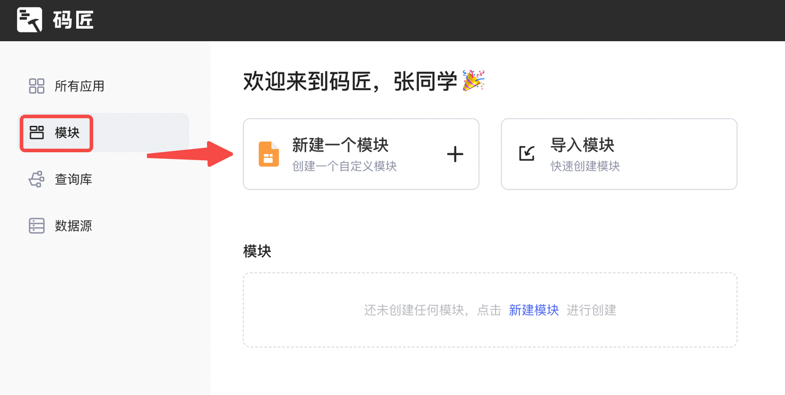

1. 在模块编辑界面左侧边栏，可以 `设置` 模块的 **输入** 、 **输出** 、**方法**和 **事件** ：

* **输入** ：定义了使用该模块的上层应用/模块传入到该模块的参数；
* **输出** ：定义了当前模块对外暴露的数据；
* **方法** ：定义了当前模块对外暴露的方法；
* **事件** ：定义了当前模块对外暴露的事件，上层应用/模块可以绑定模块触发事件。

3. 模块编辑界面的其他部分与应用编辑界面一致，您可以像搭建应用一样插入组件和创建查询。

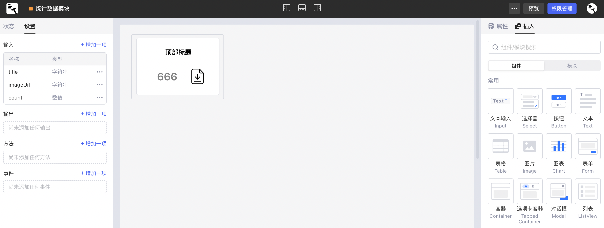

4. 在编辑应用/模块时，选择 **插入->模块** ，会展示您拥有权限的模块列表：

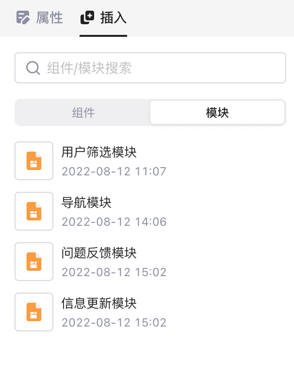

您可以拖放模块到应用/模块编辑界面的画布上，之后就像使用组件一样，在属性面板为其设置数据参数、调整样式等：

在数据浏览器面板，可以访问模块暴露的数据：

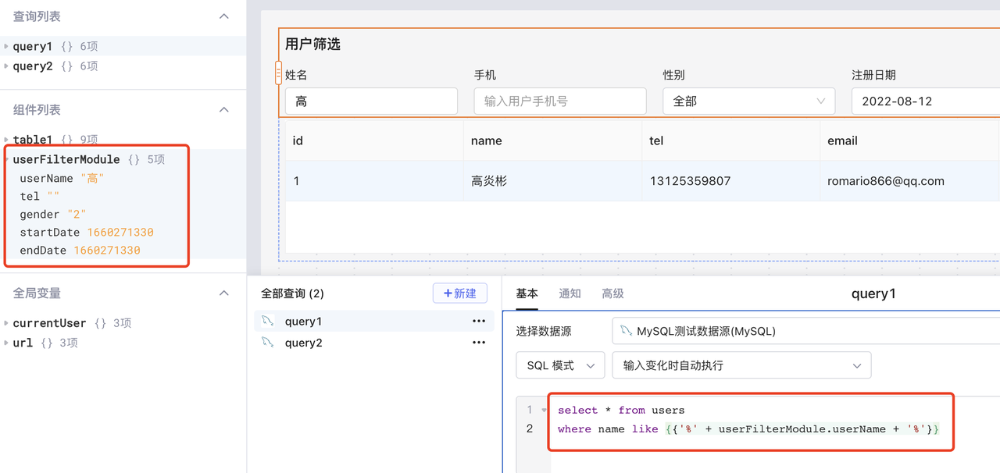

## 模块设置

### 模块输入

模块输入定义了上层应用/模块传入到该模块的参数。其可选择的类型有六种： **数据 data、字符串 string、数值 number、数组 array、布尔值 boolean 和查询 query** ，前五种都属于**数据类型**的输入，但①不限制输入的数据类型，②③④⑤限制了传入数据的具体类型。定义模块输入后，可在模块内通过其**名称**来引用该输入传入的数据。

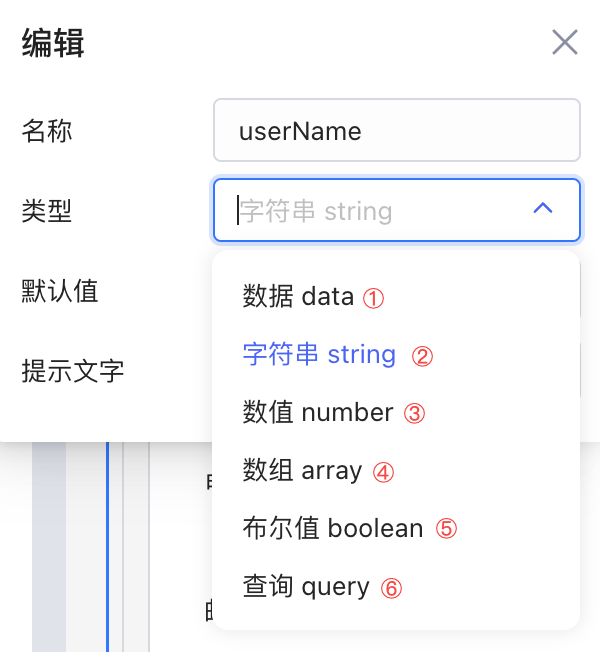

#### 案例：统计数据模块

这一部分介绍如何创建一个统计数据模块（下左图），并通过**模块输入**传入不同的值以实现复用（下右图）。

1. 在模块编辑界面左侧选中 **设置** ，点击**增加一项**模块输入，再设置其 **名称** 、 **类型** 、 **默认值（选填）** 和 **提示文字（选填）** 。在本例中，一共定义了三个模块输入：**字符串**类型的文本输入 `title` 和图片链接输入 `imageUrl` ，以及**数值**类型的输入 `count`。

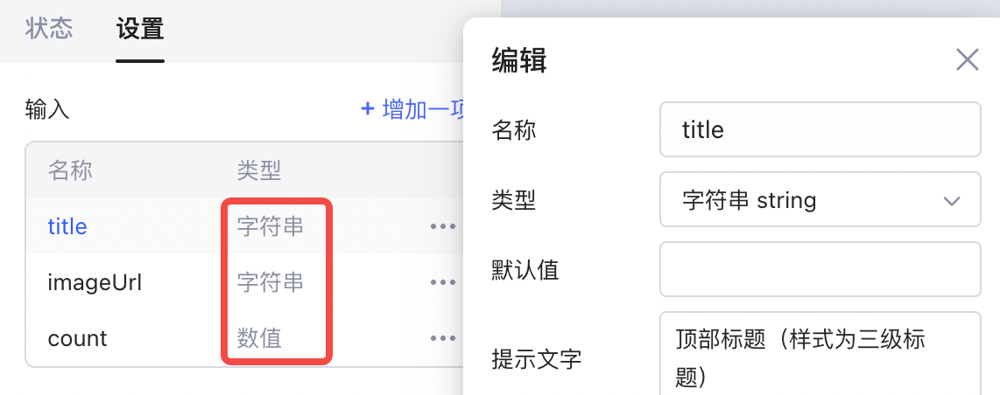

2. 拖拽添加一个**容器**到模块中，再添加两个**文本组件**和一个**图片组件**到容器中；分别调整好模块和组件的布局、高度、样式等；之后将组件与输入参数进行绑定，如下图所示，将图片组件的**图片地址**与 `imageUrl.value` 进行绑定：

3. 此时模块已经搭建完成，上层应用可以插入刚刚新建好的 **模块** 。可以看到，上面定义的三个模块输入被展示为整个模块的三个属性，接着就可以像配置普通组件的属性一样配置模块，如下图：

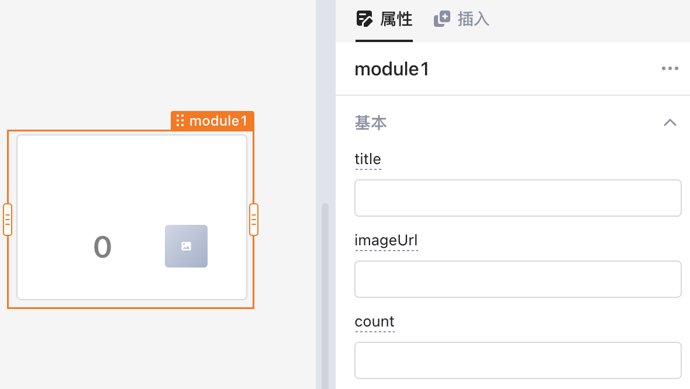

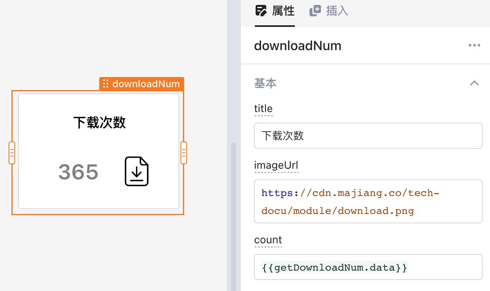

4. 最后，可以多次复用模块，为模块配置不同的属性值、绑定不同的查询结果等，以展示不同的效果。

#### 输入测试

在 **模块编辑界面** ，选中整个模块，可以在右边的属性面板中用模拟数据进行 **输入测试** 。如下图，分别为三个输入参数 `title`、`imageUrl` 和 `count`设置测试值：

### 模块输出

模块输出为当前模块被引用时对外暴露的数据。在使用模块时，模块的数据可以像其它组件或查询的属性一样通过 `{{ }}` 访问并在左侧数据浏览器中查看。

下图搭建了一个用户筛选模块，暴露了 `userName`、`tel`等数据：

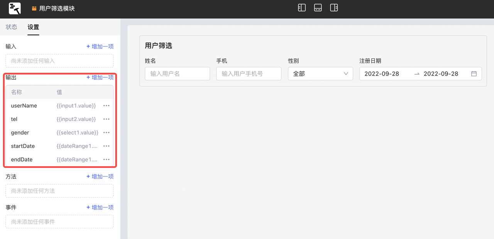

使用该模块的应用/模块，可以引用该模块的输出：

### 模块方法

模块方法定义了当前模块被引用时对外暴露的方法。

#### 定义方法

在模块编辑界面的左侧边栏中，可以**增加一项**模块方法：

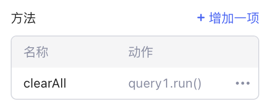

点击可以编辑方法的名称以及方法被调用时执行的动作：

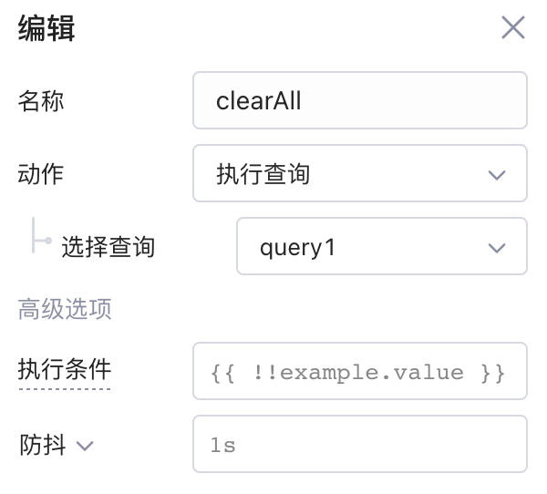

假设当前模块里有两个输入框，方法 `clearAll` 提供清除两个输入框的内容的能力，此时新增一个查询调用两个输入组件的 `clearValue` 方法，并绑定到 `clearAll` 执行的动作上，如下图：

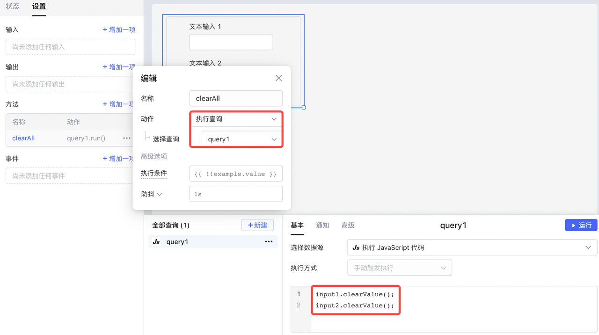

#### 调用方法

使用模块时，可以通过两种方式调用模块方法：

* 在组件触发事件的动作选择器中，选择 **控制组件** ，再选择正确的**组件**和 **方法** ：

* 在 JS Query 中，通过组件名称进行调用，如 `module1.clearAll()`。

#### 方法测试

编辑模块时，在属性编辑区可以进行 **方法测试，** 如下图：

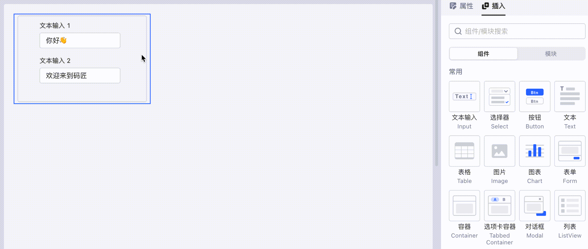

### 模块事件

模块事件定义了当前模块对外暴露的事件，上层应用/模块可以绑定模块触发事件。编辑模块时，可以**定义**和**触发**模块事件；使用模块时，可以绑定模块事件。

#### 定义事件

在模块编辑界面左侧边栏，点击**增加一项**事件，再点击该事件修改名称，完成事件的定义：

#### 触发事件

下面示例中，模块里有两个输入框，此时希望任一输入框内容变化时都能触发模块事件 `contentChange`。可以通过以下两种方式触发：

* 设置输入框属性 **交互**  **-> 事件** ，当**内容改变**时动作设置为 **触发模块事件** ，之后选择事件`contentChange`，如下图：

* 在 JS Query 中，通过语句 `contentChange.trigger()` 来触发模块事件。

#### 事件响应

上层应用/模块使用模块时，可以为模块事件绑定相应的动作：

#### 事件测试

编辑模块时，在属性编辑区可以进行 **事件测试。** 如下图，输入框内容变化时触发全局提示：

#### 案例：用户详情模块

在这一部分，我们希望创建一个用户详情模块，既能展示用户表中某个用户的详情，又能更新用户信息。

1. 新建一个模块，插入一个表单组件到模块中，并点击 **从数据源快速生成数据** ，用 MySQL 模板数据源中的表 `users` 快速生成表单，如下图：

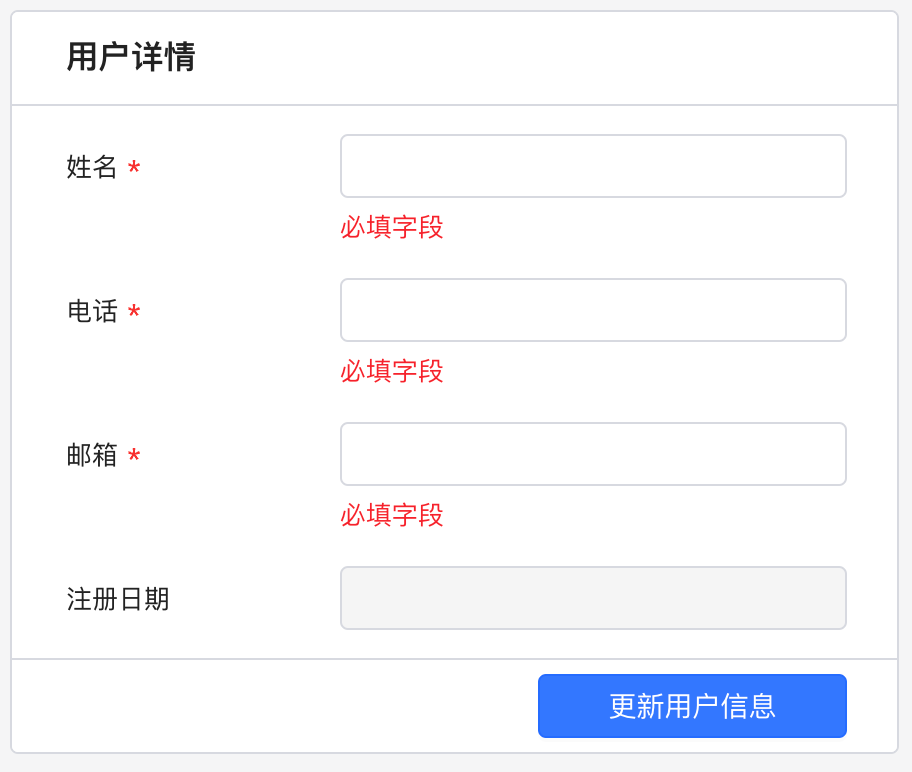

2. **增加一项**数值类型的模块输入 `userId`；新建一个查询 `getUserById`，输入下图所示的查询语句，其作用是通过参数 `userId` 查找用户信息；在右侧模块属性区中填写 `userId` 的模拟值，可以进行输入测试：

3. 从数据源创建表单后，Lowcoder会同时自动创建一个基于表单的插入查询 `form1SubmitToUsers`，并绑定到表单的提交事件，其作用是提交表单时自动更新表 `users`。在上层应用/模块中，表的更新是一个需要实时监听及响应的事件，需实时刷新表格来展示最新值。因此，这里我们**增加一项**模块事件 `UserUpdated`，并选择在查询 `form1SubmitToUsers` 执行成功后**触发模块事件** `UserUpdated`：

4. 新建一个应用，插入一个表格和创建好的模块，分别用于展示所有用户和单个用户的信息；新建一个查询 `refreshUsers`，输入下图的 SQL 语句，以 id 顺序展示用户信息，并将表 `table1` 的数据属性与查询结果绑定：

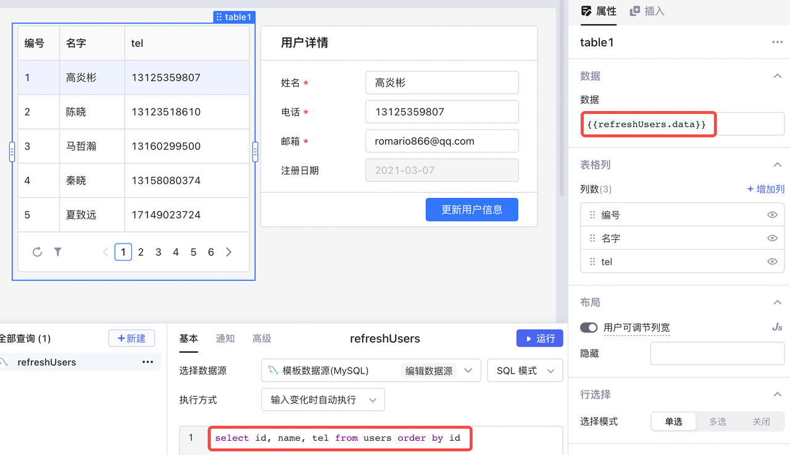

5. 配置模块的输入参数 `userId` 为 `{{table1.selectedRow.id}}`，用表单展示表格当前选中用户的详情信息：

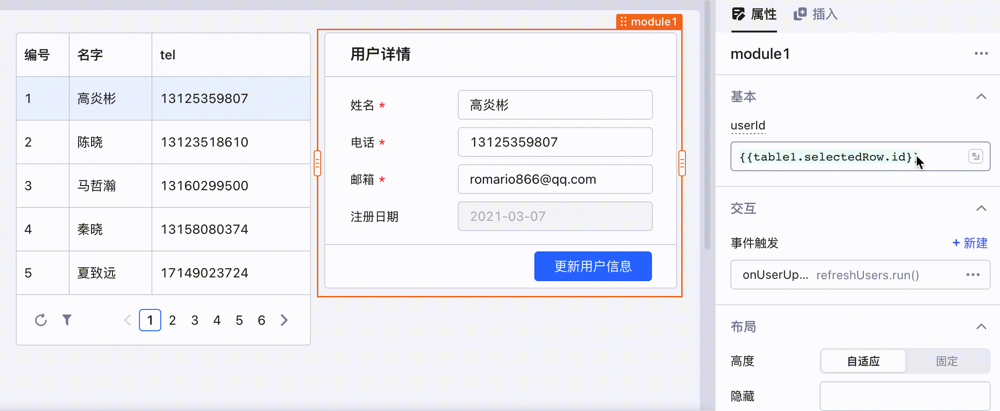

6. 在模块属性中**事件**的右边点击 **新建** ，选择触发 `UserUpdated` 后执行查询 `refreshUsers`。此时，在表单中修改用户信息并提交，会触发模块事件 `UserUpdated`，进而执行查询 `refreshUsers`，实现表格的实时更新：

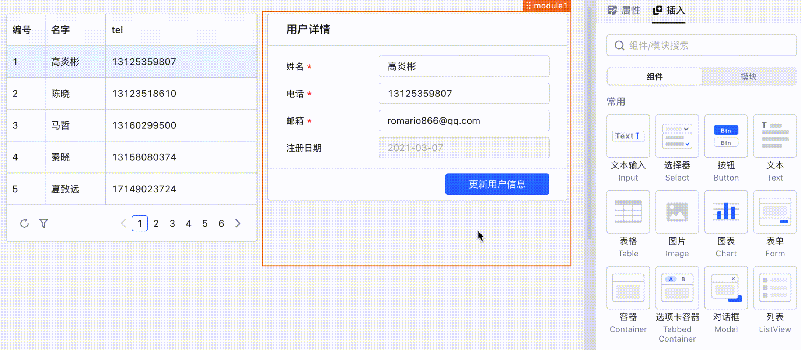

## 尺寸调整

搭建模块时，可通过拖动右下角调整模块的尺寸，该尺寸即为拖放该模块到画布上的默认大小。在模块属性中，可以控制组件高度是否 **随容器缩放** 。其中，自适应高度的组件不随模块变化，固定高度的组件随模块变化。

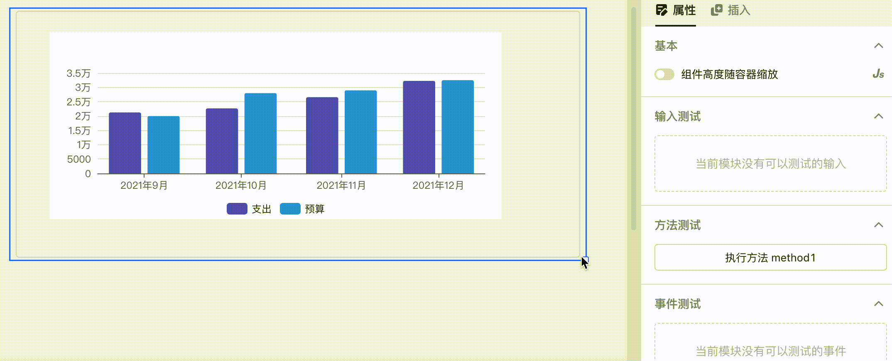

## 权限

查看应用/模块时，用户将自动拥有该应用/模块内被使用模块的查看权限。模块的其他权限分配规则与应用一致。

## 版本

与应用版本控制一样，模块在被使用后依然可以继续编辑与发布。上层应用/模块将自动加载所包含的模块的最新发布版本。